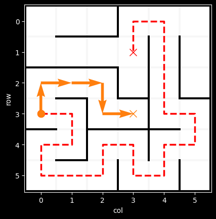
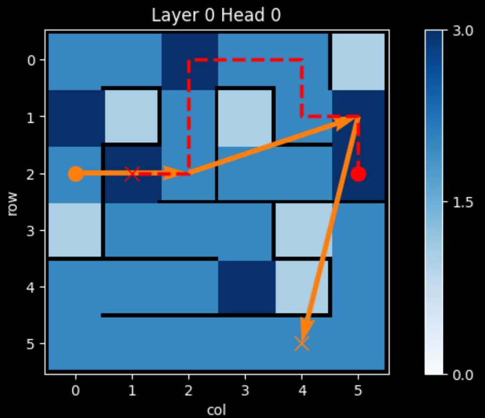
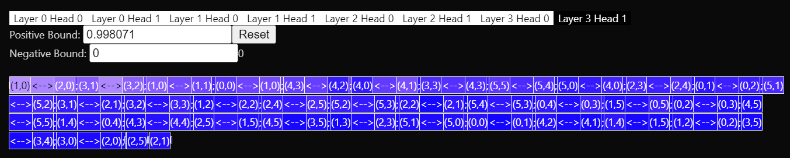

<!-- [](https://pypi.org/project/TODO/)
 -->
[](https://github.com/understanding-search/maze-transformer/actions/workflows/checks.yml)
[](docs/coverage/coverage.txt)


# Maze Transformer

This repo is built to facilitate the training and analysis of autoregressive transformers on maze-solving tasks.

|     |     |     |
| :-: | :-: | :-: |
|  |  |  |





# Installation
```
pip install git+ssh://git@github.com/understanding-search/maze-transformer.git
```

Note: if you want to install the library in colab, follow the steps in this [Colab notebook](https://colab.research.google.com/drive/1b8E1rkqcKRdC4bs9133aBPEvqEaH5dqD#scrollTo=8VbjoPRgXlqs).

You can run all tests via
```bash
make test
```
(this will take a few minutes)


# Usage

Most of the functionality is demonstrated in the ipython notebooks in the `notebooks/` folder.

- `demo_dataset.ipynb` how to easily create a dataset of mazes, utilities for filtering the generates mazes via properties, and basic visualization
- `train_model.ipynb` configuration setup and training a basic model
- `eval_model.ipynb` loading a trained model, and computing various metrics on its performance on a dataset
- `plot_attention.ipynb` various attention visualization utilities
- `demo_latticemaze.ipynb` internals of the `LatticeMaze` and `SolvedMaze` objects, and advanced visualization
- `train_model_hallway.ipynb` training a model on a customized dataset


# Development

## Prerequisites

* Install [Poetry](https://python-poetry.org/docs/#installation)
* Install Python 3.10
    * It's a good idea to use [pyenv](https://github.com/pyenv/pyenv) to manage python versions
    * If using pyenv, you'll need to update your Poetry config for it to use the pyenv Python version: `poetry config virtualenvs.prefer-active-python true`
* Install dev dependencies
    ```
    poetry config virtualenvs.in-project true
    poetry install --with dev
    ```
* Run unit, integration, and notebook tests
    ```
    make test
    ```

* (Optional) If you want to work with the jupyter notebooks in VSCode
  * create a jupyter kernel with `poetry run ipython kernel install --user --name=maze-transformer`
  * Restart VSCode
  * In VSCode, select the python interpreter located in `maze-transformer/.venv/bin` as your juptyer kernel


## Testing & Static analysis

`make help` will print all available commands.

- all tests via `make test`
    - unit tests via `make unit`
    - integration tests via `make integration`
    - notebook tests via `make test_notebooks`

- formatter (black, pycln, and isort) via `make format`
    - formatter in check-only mode via `make check-format`
